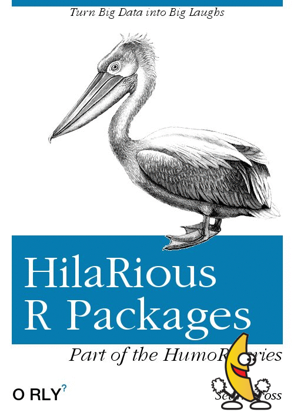
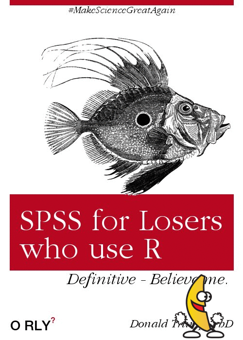

```{r setup, include=FALSE}
knitr::opts_chunk$set(echo = TRUE)
```

In this project I will make a function that uses magick to add a dancing banana
gif to every image. 

This is directly from the magick vignette

- check if file is an image
- find dimensions of image
- scale banana gif
- add gif to image 

See also the blogpost at:

* http://rmhogervorst.nl/cleancode/blog/2017/11/28/building-the-oomsifier.html
* http://rmhogervorst.nl/cleancode/blog/2017/12/29/extending-the-oomsifyer-cmdline.html


you will find the scripts in the folder R. 

REsults of the banana trick:





